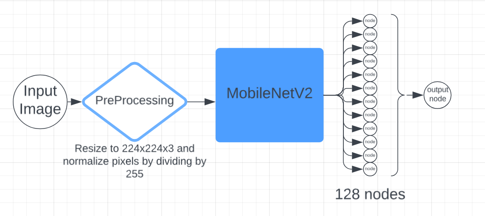

# Masked-Gender-Classifier
A model built with keras based on MobileNetV2 to extract facial features from masked images and classify their gender

## HOW TO USE THE MODEL
- model.ipynb contains the code used in creation and training of the model. 
- TrainedModel.ipynb is the interface notebook I have created to easily use the model. 
- **TO USE :** in the predict function in TrainedModel.ipynb, pass the name of the input image saved in samples folder. It will display the image with TEXT: MALE/FEMALE etched on it.
- There are 14 images already saved in the form of 1.jpg, 2.jpg, ... in the samples folder.
- app.py contains the gradio frontend for the model, Use it with input image of your choice, or use the ones provided in samples folder.

## DATASET
Found the dataset on kaggle -
https://www.kaggle.com/datasets/itsshuvra/gender-classified-dataset-with-masked-face/data

The folder 
\archive\GenderOcclusionData\Training Contains two folders male and female which have around 35000 masked images each, out of which the model is trained on 1200 images each 
Another folder \archive\GenderOcclusionData\Validation contains aobut 8000 images each which were not used in the training process but few of them have been included in the samples folder for demonstration in TrainedModel.ipynb.

## APPROACH / ROADBLOCKS
The model is based on the pre-trained CNN MobileNetV2 without its last output layer which is replaced by a 128 node fully dense layer and a single node at the end layer. The input shape is 224x224x3.
  
Intially the accuracy of the model was 55% which is pretty much negligible since its a 50-50 binary prediction. To increase the accuracy, the data augmentation step (brightness zoom pinch span etc) was omitted because the dataset was compiled via webscraping google and had significant rotation and translational shear. This boosted the accuracy to 76% on training of 500 images per category.  
The final model was made with 1200x2 training images (Max my 8gb laptop could handle) which gave **final accuracy of 83.29%**.
## SCREENSHOTS AND FLOWCHARTS

